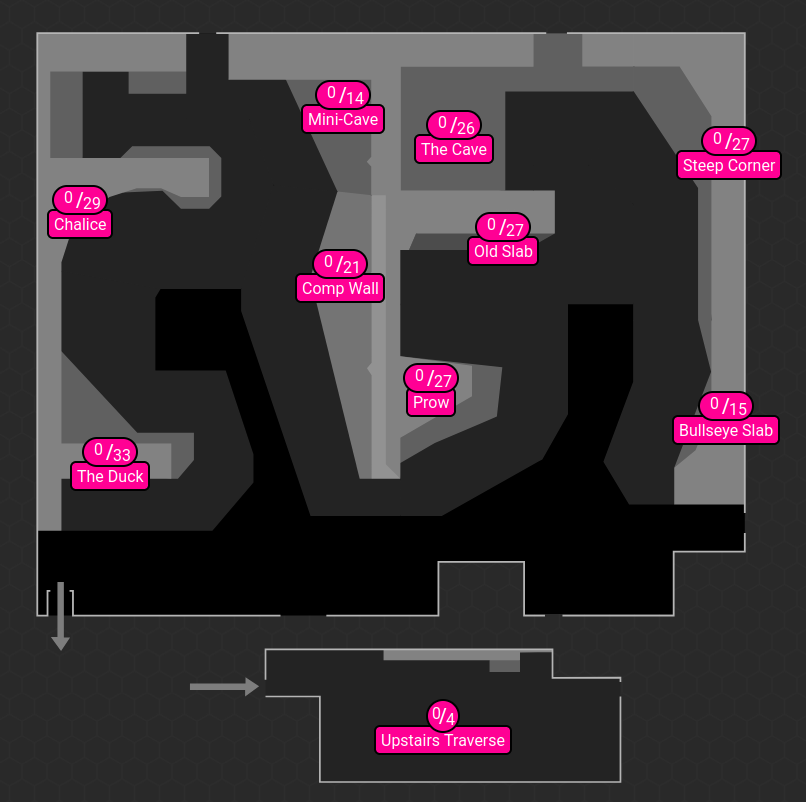

# Soft Climb Finder

This quick project helps you find the easiest climbs at your climbing gym for their grades based on the number of tops retrieved from TopLogger. Is this aid? probably...



### Getting Started
To get up and running with the code base it is good practice to use a virtual enviroment. This can be setup on using the following commands.

```
python -m venv myenv
source myenv/bin/activate  # macOS/Linux
myenv\Scripts\activate     # Windows

python -m pip install --upgrade pip  # reccomended but not essential
```

**Running the Script**

1. Make sure you have your TopLogger gym ID. You can find this by logging into TopLogger and navigating to your desired gym. The gym ID is located in the URL after "gymId=". For example, if the URL is [https://app.toplogger.nu/en-us/boulder-brighton/boulders](https://app.toplogger.nu/en-us/boulder-brighton/boulders) then the gym ID is "hf64ufvvw8s60c3scpqcj".

2. Edit the `get_data.py` script to replace `"gym_id_here"` with your actual gym ID.

3. Run the script:

```bash
python get_data.py
```

This will create two files in the `data` directory:

* `boulders.json`: This file contains the raw data retrieved from TopLogger.
* `cleaned_boulders.csv`: This file contains the processed data, including the font grade, hold color, wall name, number of ticks (attempts), date the climb was set, and planned removal date.

4. The script will then print a table showing the top 20 easiest climbs (based on normalized top counts) in your gym.


**Explanation of the Files**

* `get_data.py`: This script retrieves the boulder data from TopLogger using their GraphQL API.
* `preprocess.py`: This script cleans and processes the raw data from TopLogger.
* `find_easy_problems.py`: This script finds the easiest climbs based on the normalized top counts.
* `data`: This directory stores the data files generated by the script.
* `docs`: This directory may contain additional documentation, such as a visual layout of how the easiest climbs are identified in the gym (optional).


**How it Works**

1. The script retrieves data on all the boulder climbs from your chosen gym using TopLogger.
2. It then cleans and processes the data, extracting relevant information such as the climb difficulty grade, number of times the climb has been successfully completed (tops), and the date the climb was set.
3. It then calculates a normalised top count for each climb. This is done by dividing the number of tops for a climb by the median number of tops for climbs of the same difficulty grade. This helps to account for the fact that some grades may generally have more tops than others.
4. Finally, the script identifies the climbs with the highest normalized top counts, which are likely to be the easiest climbs in the gym for the grade.
